## 🚀 About Me

I am a Software Engineering deeply focused on **AI Engineering** and **AI Architecture**. I specialize in creating robust, scalable backend systems and designing intelligent solutions to complex real-world problems. My current research and development focus lies in leveraging **Multimodal Retrieval-Augmented Generation (RAG)** pipelines to bridge the gap between traditional software development and advanced artificial intelligence.

- 🤖 **Current Focus:** AI Architecture, Large Language Model (LLM) orchestration, and AI Agents.
- 🎓 **Education:** Studying Data Science at Estácio de Sá.
- 🗣️ **Languages:** Portuguese (Native), English (Advanced), Spanish (Basic).

---

## 🛠️ Tech Stack & Skills

### 🧠 AI & Cloud Infrastructure

### ⚙️ Back-End Development

### 💻 Front-End Development

### 🗄️ Databases & Core Methodologies

---

## 📊 GitHub Analytics

  

 

  

---

## 🤝 Connect with Me

  
  

   
  
<b>"Be your better version!"</b>

